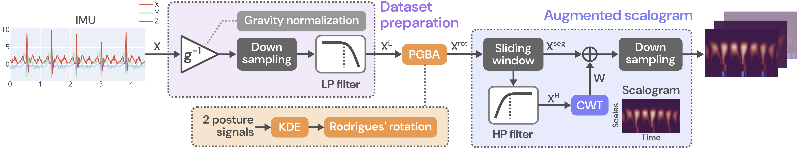
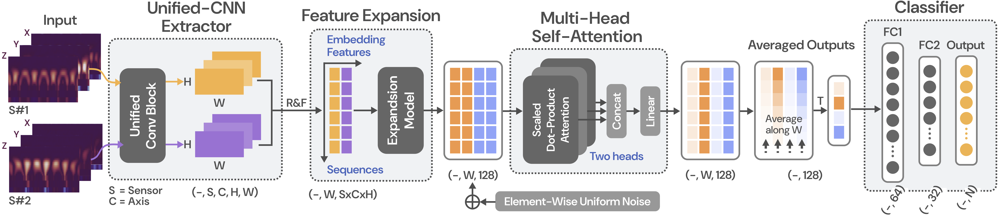

# COSAR: General Cross-Dataset Human Activity Recognition

<p align="center">
  
  <br>
  <em>Figure 1: Preprocessing Pipeline</em>
</p>
<p align="center">
  
  <br>
  <em>Figure 2: Model pipeline</em>
</p>

## Abstract

Human Activity Recognition (HAR) faces significant cross-dataset generalization challenges due to sensor heterogeneity, which critically degrades its performance in real-world applications. To address these, we propose **COSAR** (general **C**r**O**ss-data**S**et human **A**ctivity **R**ecognition), a unified framework that integrates three core components.

First, **Personalized Gravity-Based Alignment (PGBA)** derives subject-specific coordinate transformations into a unified global reference frame via reference pose calibration. Second, an **augmented scalogram** — derived from a continuous wavelet transform with geometric scaling — enables adaptive time-frequency feature extraction that outperforms conventional methods in distinguishing static from dynamic activities. Third, a **hybrid deep learning architecture** incorporating unified convolutions, feature expansion, and multi-head self-attention improves generalization under sensor placement variation.

Cross-dataset evaluations achieve state-of-the-art results of **82.60 ± 4.92%** when training on mHealth and testing on PAMAP2, and **91.51 ± 9.77%** in the inverse direction. When trained on mHealth and PAMAP2 separately, PGBA improves performance by **32–37%** on the DSADS dataset under sensor-location discrepancies. The hybrid architecture reduces model parameters by **98.73%** compared to existing attention-based frameworks, while improving classification accuracy by **13.46%** (from 73.6% to 87.06%). Ablation studies further confirm that the feature expansion module provides strong robustness against signal variations in cross-placement scenarios.

These results demonstrate that COSAR generalizes effectively across heterogeneous sensor configurations, providing a stable, tuning-free alignment solution that requires no prior knowledge of sensor orientations — making it well-suited for real-world deployment with non-standardized sensor placement.

> [!NOTE]
> This repository also includes code from the paper [**BAMS: Binary Sequence-Augmented Spectrogram with Self-Attention Deep Learning for Human Activity Recognition**](https://ieeexplore.ieee.org/document/10780593), where you can use the [AugmentedSTFT](data/preprocessing/aug_stft.py) feature extraction method and its [model](models/bams.py).

---

## Installation

### Using Conda *(Recommended)*

1. Ensure [Conda](https://docs.conda.io/en/latest/) is installed on your system.
2. Navigate to the project directory.
3. Create and activate the environment:

```bash
conda env create -f installation/environment.yml
conda activate cosar-env
```

### Using pip

1. Ensure Python and pip are installed on your system.
2. Navigate to the project directory.
3. Install the required dependencies:

```bash
pip install -r requirements.txt
```

## Trained Weights

Pre-trained model weights for all experiments are available on Google Drive:

📦 **[Download Trained Weights](https://drive.google.com/drive/folders/1BxFsUqdeZVljhIa2m-QdkJM6XpkeAXaT?usp=sharing)**

The weights follow this structure:
```
trained_model/{model_name}/seed/{source_dataset}/{naive or realigned}-{seed}.pt
```
Place the downloaded `trained_model/` folder in the root directory of this project.

---

## Command-Line Arguments

### Options

| Argument | Short | Type | Default | Description |
|---|---|---|---|---|
| `--device` | `-n` | `str` | `cuda:0` | Compute device to use |
| `--dataset` | `-d` | `str` | `pamap2` | Source/Target dataset name |
| `--model-file` | `-f` | `str` | `''` | Path to a pre-trained model file |
| `--model` | | `str` | `cosar` | Model architecture to use |
| `--fe` | | `str` | `aug-cwt` | Feature extraction method [None, aug-STFT, aug-cwt] |
| `--method` | | `str` | `supervised` | Learning method |

### Flags

| Argument | Description |
|---|---|
| `--all` | Include all activity classes |
| `--training` | Run in training mode |
| `--testing` | Run in testing mode |
| `--seed_eval` | Evaluate performance across multiple random seeds |
| `--kde_eval` | Evaluate sensitivity to KDE parameters |

---

## Usage

Before running any experiment, please review `configure.py` for key settings such as `is_rotate` (PGBA alignment), `window_size`, and `step_size`.

### Training

```bash
python main.py --training -d <source_dataset> -n <device>
```

Trained models are saved under `/trained_model/` using the following naming conventions:

| Mode | Output Path |
|---|---|
| Standard | `/trained_model/<model_name>/seed/<source_dataset>/<method>-0.pt` |
| Multi-seed (`--seed_eval`) | `/trained_model/<model_name>/seed/<source_dataset>/<method>-<seed_number>.pt` |

> [!NOTE]
> With `--seed_eval`, models are trained and saved automatically for each seed (0–4).

### Testing
Evaluation results are reported as **accuracy** and **weighted F1-score**.


```bash
# Single seed
python main.py -f trained_model/<model_name>/seed/<source_dataset>/<method>-0.pt -d <target_dataset>

# Multiple seeds
python main.py -f trained_model/<model_name>/seed/<source_dataset> -d <target_dataset>
```


